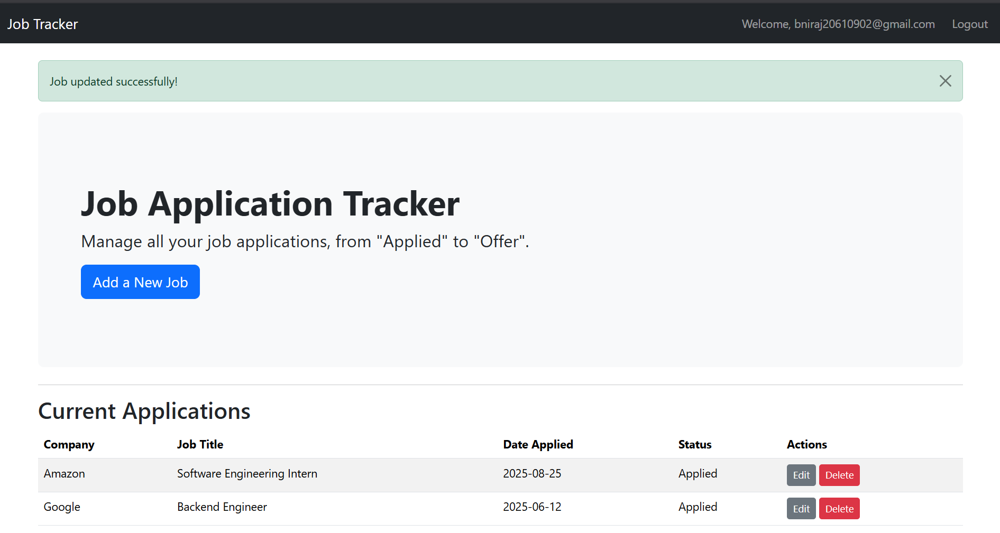
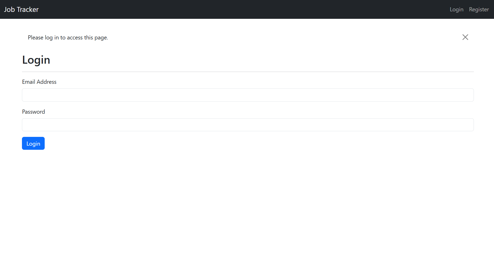

# Job Application Tracker

A simple web app for managing your job applications. I originally built this to track my own internship applications instead of using messy spreadsheets.




**Live Demo:** <https://job-tracker-3jrp.onrender.com>

---

### Features

* **User Accounts:** Secure registration and login to keep your list private.
* **Manage Applications:** Add, view, edit, and delete your job entries.
* **Simple Dashboard:** See all your applications in a clean, organized table.

### Tech Stack

* **Backend:** Python, Flask, SQLAlchemy
* **Frontend:** HTML, Bootstrap 5

---

### Running Locally

To run this project on your own machine:

1.  **Clone the repository and set up the environment:**
    ```sh
    git clone [https://github.com/niraj-07/Job-Tracker.git](https://github.com/niraj-07/Job-Tracker.git)
    cd Job-Tracker
    python -m venv venv
    ```

2.  **Activate the virtual environment:**
    * On **Windows** (in Git Bash):
        ```sh
        source venv/Scripts/activate
        ```
    * On **macOS/Linux**:
        ```sh
        source venv/bin/activate
        ```

3.  **Install the required packages:**
    ```sh
    pip install -r requirements.txt
    ```

4.  **Create the database:**
    * Start the Python interpreter:
        ```sh
        python
        ```
    * Run these commands inside the interpreter:
        ```py
        from app import app, db
        with app.app_context():
            db.create_all()
        exit()
        ```

5.  **Launch the application:**
    ```sh
    flask run
    ```
    The app will be running at `http://127.0.0.1:5000`.